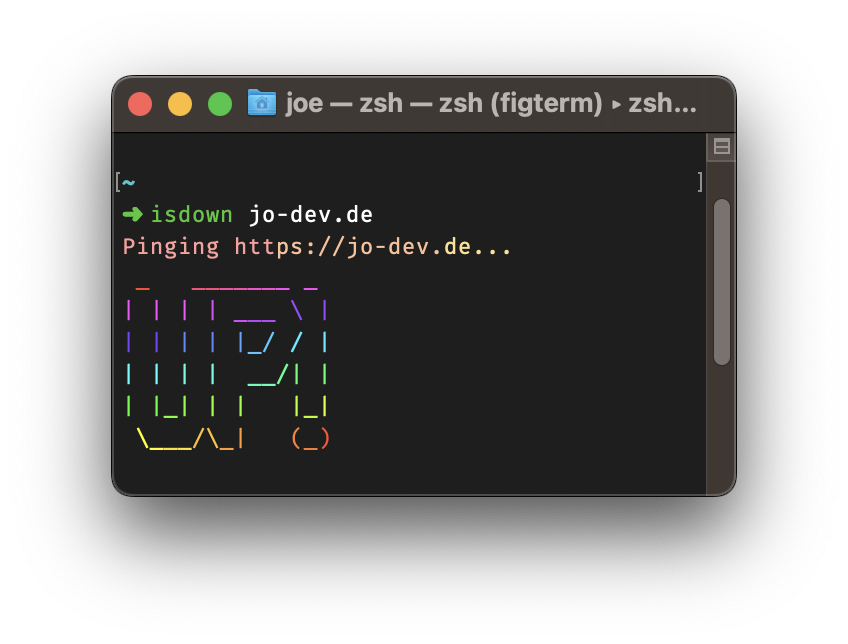

<h1 align=center> down-cli  -  isdown? </h1>

<div align=center>


</div>

<br>

> A CLI that tests if a website is down



## Install

```bash
$ git clone https://github.com/ITegs/down-cli.git
$ cd down-cli
$ npm install
$ npm link
```

## Usage

```bash
$ isdown <url> [options]

## Options

  -v, --verbose  verbose output
```

<br>
<br>

## License

Licensed under the [MIT license](https://github.com/ITegs/down-cli/blob/main/LICENCE.md).
